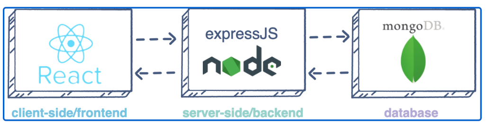

# MERN-DEPLOYMENT

In this project, I will be documenting how I deploy a MERN STACK ON AWS. 

M - MongoDB
E - ExpressJS
R - ReactJS
N - NodeJS

A user interacts with the ReactJS UI components at the application front-end residing in the browser. This frontend is served by the application backend residing in a server, through ExpressJS running on top of NodeJS