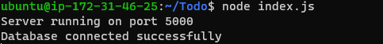
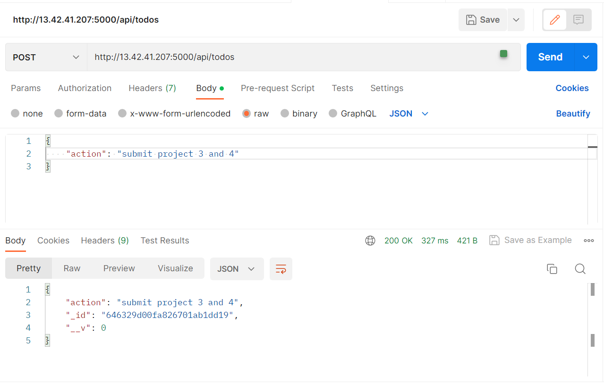
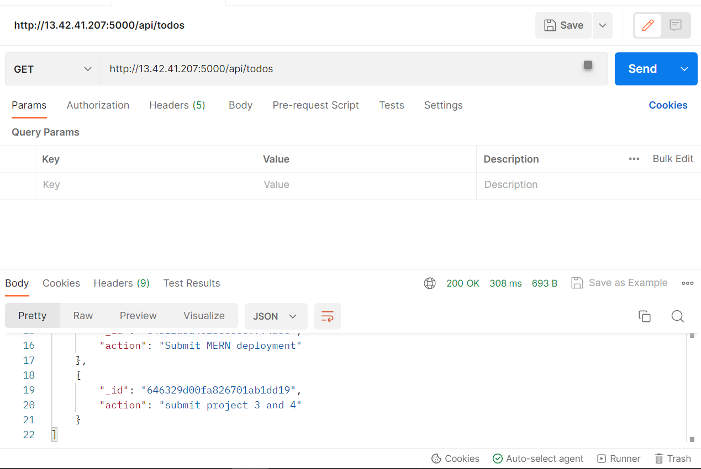
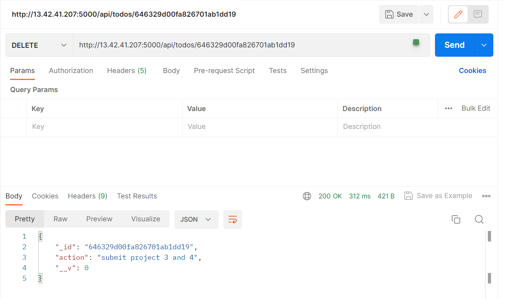
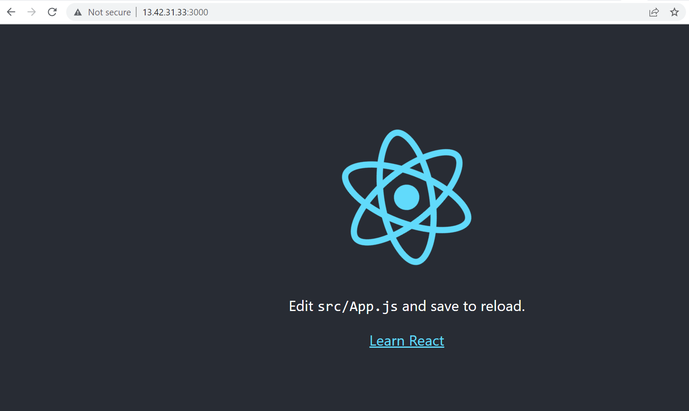
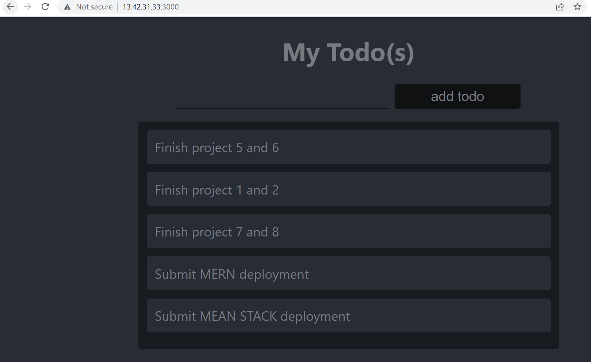

# SIMPLE TO DO APPLICATION ON A MERN WEB STACK

In this project, I will be deploying a to-do application on a MERN webstack. 

## BACKEND CONFIGURATION 

First off let us begin with spinning up a new instance on AWS 

The following commands are used to update apt 

`sudo apt update` , `sudo apt upgrade`

The location of Node.js software from Ubuntu repositories is gotten from here:
`curl -fsSL https://deb.nodesource.com/setup_18.x | sudo -E bash -`

The installation of Node.js on the server is done using the command below:
`sudo apt-get install -y nodejs` 

The node and npm version installed can be seen in the picture below:


### To-do App Code Setup

I create the folder 'Todo' - `mkdir Todo` and within the foler I initialiase my project using `npm init`. This creates a file called 'package.json' will be created and the file will contain information about my application and the dependencies that it needs to run. 

### Install expressJS

ExpressJS is a framework for Node.js, therefore a lot of things developers would have programmed is already taken care of out of the box. Therefore it simplifies development, and abstracts a lot of low level details. For example, Express helps to define routes of your application based on HTTP methods and URLs. 

Express is installed using the command `npm install express`
I create a new file (index.js) using the command `touch index.js`

I install the dotenv module using the command `npm install dotenv`

My code is pasted in the index.js file which can be seen below: 
'''
const express = require('express');
require('dotenv').config();

const app = express();

const port = process.env.PORT || 5000;

app.use((req, res, next) => {
res.header("Access-Control-Allow-Origin", "\*");
res.header("Access-Control-Allow-Headers", "Origin, X-Requested-With, Content-Type, Accept");
next();
});

app.use((req, res, next) => {
res.send('Welcome to Express');
});

app.listen(port, () => {
console.log(`Server running on port ${port}`)
});

'''

Within the code, port 5000 has been specified in the code which is where the app will be listening on. 

Now start our server to see if it works. Within the same directory as my index.js I run the command - `node index.js`

Remember the port has to be opened in EC2 security groups to allow access to the port 5000. 

The server is accessed on 'http://<PublicIP-or-PublicDNS>:5000'


### Routes

There are three actions the application needs to be able to do:

1. Create a new task
2. Display list of all tasks
3. Delete a completed task

Each task will be associated with some particular endpoint and will use different standard HTTP request methods: POST, GET, DELETE.

For each task, we need to create routes that will define various endpoints that the To-do app will depend on. So let us create a folder routes using the command - `mkdir routes`

Within the routes folder, I create a file called api.js and paste the code below in it.
```
const express = require ('express');
const router = express.Router();

router.get('/todos', (req, res, next) => {

});

router.post('/todos', (req, res, next) => {

});

router.delete('/todos/:id', (req, res, next) => {

})

module.exports = router;

```

### Models

Since the app is going to make use of Mongodb which is a NoSQL database, I will be creating a model.

A model is at the heart of JavaScript based applications, and it is what makes it interactive.

We will also use models to define the database schema . This is important so that we will be able to define the fields stored in each Mongodb document. 

In essence, the Schema is a blueprint of how the database will be constructed, including other data fields that may not be required to be stored in the database. These are known as virtual properties

To create a Schema and a model, install mongoose which is a Node.js package that makes working with mongodb easier.

Change directory back Todo folder with cd .. and install Mongoose using the command `npm install mongoose`

I create a new folder called 'models' and within models I create another file 'todo.js' and paste the following code below: 

```
const mongoose = require('mongoose');
const Schema = mongoose.Schema;

//create schema for todo
const TodoSchema = new Schema({
action: {
type: String,
required: [true, 'The todo text field is required']
}
})

//create model for todo
const Todo = mongoose.model('todo', TodoSchema);

module.exports = Todo;

```

Now, I need to update our routes from the file api.js in 'routes' directory to  make use of the new model. 

In routes directory, the file 'api.js' is update with the code below:

```
const express = require ('express');
const router = express.Router();
const Todo = require('../models/todo');

router.get('/todos', (req, res, next) => {

//this will return all the data, exposing only the id and action field to the client
Todo.find({}, 'action')
.then(data => res.json(data))
.catch(next)
});

router.post('/todos', (req, res, next) => {
if(req.body.action){
Todo.create(req.body)
.then(data => res.json(data))
.catch(next)
}else {
res.json({
error: "The input field is empty"
})
}
});

router.delete('/todos/:id', (req, res, next) => {
Todo.findOneAndDelete({"_id": req.params.id})
.then(data => res.json(data))
.catch(next)
})

module.exports = router;
```

### MONGODB DATABASE

mLab is used to access MongoDB database as a service solution. The MongoDB service is set up and running. 

In the index.js file, we specified process.env to access environment variables, so the file will be created now. 
In my todo directory, the file is created using the command `touch .env` and the connection string to access the database is pasted in it 'DB = 'mongodb+srv://<username>:<password>@<network-address>/<dbname>?retryWrites=true&w=majority''

The <username>, <password>, <network-address> and <database> were updated according to my setup.

Now, I'll be updating the index.js file to reflect the use of the .env so that Node.js can connect to the database.

The index.js file is updated with the code below:
```
const express = require('express');
const bodyParser = require('body-parser');
const mongoose = require('mongoose');
const routes = require('./routes/api');
const path = require('path');
require('dotenv').config();

const app = express();

const port = process.env.PORT || 5000;

//connect to the database
mongoose.connect(process.env.DB, { useNewUrlParser: true, useUnifiedTopology: true })
.then(() => console.log(`Database connected successfully`))
.catch(err => console.log(err));

//since mongoose promise is depreciated, we overide it with node's promise
mongoose.Promise = global.Promise;

app.use((req, res, next) => {
res.header("Access-Control-Allow-Origin", "\*");
res.header("Access-Control-Allow-Headers", "Origin, X-Requested-With, Content-Type, Accept");
next();
});

app.use(bodyParser.json());

app.use('/api', routes);

app.use((err, req, res, next) => {
console.log(err);
next();
});

app.listen(port, () => {
console.log(`Server running on port ${port}`)
});
```
The server is stated using the command `node index.js` and we can see it is connected to the database successfully. 



### Backend Testing with Postman

So far, the database and backend part of the code has been written and configured. 
I will be using postman to test our API. 

The following images show the results of our API tests (GET, POST and DELETE)






Now I have made sure that the backend supports all 3 operations we want: 
1. Display a list of tasks – HTTP GET request
2. Add a new task to the list – HTTP POST request
3. Delete an existing task from the list – HTTP DELETE request

# FRONT END CREATION

The backend functionality has been built, configured and tested. 

I will be using the `create-react-app` command to scaffold the app. In the same root directory, I run `npx create-react-app client`, this creates a new directory called client and this is where I'll add all the react code. 

## Running the React App

Before running the app the following dependencies are installed:
1. concurently is installed to run more than one command from the same terminal window - `npm install concurrently --save-dev`
2. nodemon is installed to run and monitor the server, if there is any change in the server code, nodemon will restart it automatically and load the new changes - `npm install nodemon --save-dev`

In the Todo folder, the package.json file is updated with the following code with the key value "scripts".

'''
"scripts": {
"start": "node index.js",
"start-watch": "nodemon index.js",
"dev": "concurrently \"npm run start-watch\" \"cd client && npm start\""
},

'''

In order to test my application, I go to the run the command `npm run dev` in the todo directory and the application is run on port 3000.

In the image below the react app can be seen 


### Creating the React Components
One of the advantages of react is that it makes use of components, which are reusable and also makes code modular. For the Todo app, there will be two stateful components and one stateless component.

Within my src folder (Todo/client/src), I make the components folder. Within the components directory I create 3 files "Input.js, ListTodo.js, and Todo.js"

Within the Input.js I write the following code inside it 
'''
import React, { Component } from 'react';
import axios from 'axios';

class Input extends Component {

state = {
action: ""
}

addTodo = () => {
const task = {action: this.state.action}

    if(task.action && task.action.length > 0){
      axios.post('http://localhost:5000/api/todos', task)
        .then(res => {
          if(res.data){
            this.props.getTodos();
            this.setState({action: ""})
          }
        })
        .catch(err => console.log(err))
    }else {
      console.log('input field required')
    }

}

handleChange = (e) => {
this.setState({
action: e.target.value
})
}

render() {
let { action } = this.state;
return (
<div>
<input type="text" onChange={this.handleChange} value={action} />
<button onClick={this.addTodo}>add todo</button>
</div>
)
}
}

export default Input


'''

To make use of axios, which is a promise based HTTP client for the browser and node.js, I run `npm install axios` in the clients folder

In the components directory, the following code is written in:
'''
import React from 'react';

const ListTodo = ({ todos, deleteTodo }) => {

return (
<ul>
{
todos &&
todos.length > 0 ?
(
todos.map(todo => {
return (
<li key={todo._id} onClick={() => deleteTodo(todo._id)}>{todo.action}</li>
)
})
)
:
(
<li>No todo(s) left</li>
)
}
</ul>
)
}

export default ListTodo


'''

Then in the Todo.js, the follwing code is written;

'''
import React, {Component} from 'react';
import axios from 'axios';

import Input from './Input';
import ListTodo from './ListTodo';

class Todo extends Component {

state = {
todos: []
}

componentDidMount(){
this.getTodos();
}

getTodos = () => {
axios.get('http://localhost:5000/api/todos')
.then(res => {
if(res.data){
this.setState({
todos: res.data
})
}
})
.catch(err => console.log(err))
}

deleteTodo = (id) => {

    axios.delete(`http://localhost:5000/api/todos/${id}`)
      .then(res => {
        if(res.data){
          this.getTodos()
        }
      })
      .catch(err => console.log(err))

}

render() {
let { todos } = this.state;

    return(
      <div>
        <h1>My Todo(s)</h1>
        <Input getTodos={this.getTodos}/>
        <ListTodo todos={todos} deleteTodo={this.deleteTodo}/>
      </div>
    )

}
}

export default Todo;
'''

Adjusting the react code, the following code is updated in the App.js file in the src folder

```
import React from 'react';

import Todo from './components/Todo';
import './App.css';

const App = () => {
return (
<div className="App">
<Todo />
</div>
);
}

export default App;
```
Updating the css app 

```
.App {
text-align: center;
font-size: calc(10px + 2vmin);
width: 60%;
margin-left: auto;
margin-right: auto;
}

input {
height: 40px;
width: 50%;
border: none;
border-bottom: 2px #101113 solid;
background: none;
font-size: 1.5rem;
color: #787a80;
}

input:focus {
outline: none;
}

button {
width: 25%;
height: 45px;
border: none;
margin-left: 10px;
font-size: 25px;
background: #101113;
border-radius: 5px;
color: #787a80;
cursor: pointer;
}

button:focus {
outline: none;
}

ul {
list-style: none;
text-align: left;
padding: 15px;
background: #171a1f;
border-radius: 5px;
}

li {
padding: 15px;
font-size: 1.5rem;
margin-bottom: 15px;
background: #282c34;
border-radius: 5px;
overflow-wrap: break-word;
cursor: pointer;
}

@media only screen and (min-width: 300px) {
.App {
width: 80%;
}

input {
width: 100%
}

button {
width: 100%;
margin-top: 15px;
margin-left: 0;
}
}

@media only screen and (min-width: 640px) {
.App {
width: 60%;
}

input {
width: 50%;
}

button {
width: 30%;
margin-left: 10px;
margin-top: 0;
}
}
```

within the src directory, I make an update to the index.css file with the code below:

```
body {
margin: 0;
padding: 0;
font-family: -apple-system, BlinkMacSystemFont, "Segoe UI", "Roboto", "Oxygen",
"Ubuntu", "Cantarell", "Fira Sans", "Droid Sans", "Helvetica Neue",
sans-serif;
-webkit-font-smoothing: antialiased;
-moz-osx-font-smoothing: grayscale;
box-sizing: border-box;
background-color: #282c34;
color: #787a80;
}

code {
font-family: source-code-pro, Menlo, Monaco, Consolas, "Courier New",
monospace;
}

```

After all the updates to the code files, I go to 'Todo' directory and run the app using the command `npm run dev`

The image below shows the app runs.



